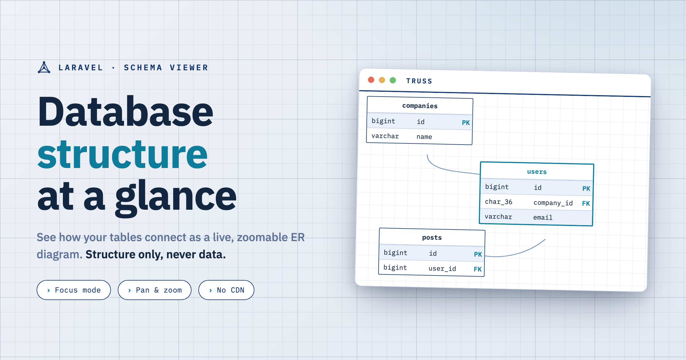

# Laravel Truss

<picture>
  <source media="(prefers-color-scheme: dark)" srcset="art/cover-dark.png">
  
</picture>

[](https://albertoarena.github.io/laravel-truss)
[](https://packagist.org/packages/albertoarena/laravel-truss)
[](https://github.com/albertoarena/laravel-truss/actions/workflows/run-tests.yml)
[](https://packagist.org/packages/albertoarena/laravel-truss)
[](LICENSE)

Laravel Truss is a live database structure viewer. It scans your live schema and renders it as a scrollable, zoomable ER diagram right inside your app, so you can see how the tables actually connect without opening a DB client. It reads **structure only** (tables, columns, keys, indexes); row data is never queried or exposed.

## Features

- Live ER diagram of your database, rendered with Mermaid.
- Focus mode: a table and its foreign-key neighbours, centred and highlighted.
- Filter by table name, and toggle native types against Laravel-style labels.
- Map-style pan and zoom, with auto-fit and a Fit button.
- Light and dark "blueprint" theme.
- Self-contained: Mermaid and fonts are vendored and served from the package, so it works offline and under a strict Content-Security-Policy (no CDN).
- Cached snapshot, rebuilt automatically after migrations.

## Documentation

Full documentation is at **[albertoarena.github.io/laravel-truss](https://albertoarena.github.io/laravel-truss)**.

- [Installation](https://albertoarena.github.io/laravel-truss/getting-started/installation/)
- [Quick start](https://albertoarena.github.io/laravel-truss/getting-started/quick-start/)
- [Authorization](https://albertoarena.github.io/laravel-truss/guides/authorization/)
- [Configuration reference](https://albertoarena.github.io/laravel-truss/reference/configuration/)

## Installation

For local use, install Truss as a dev dependency:

```bash
composer require albertoarena/laravel-truss --dev
```

To run Truss gated on staging or production, install it as a **regular dependency** instead. Dev dependencies are excluded from `composer install --no-dev` builds, so a `--dev` install never reaches a production deploy and `/truss` returns 404 there:

```bash
composer require albertoarena/laravel-truss
```

Requires **PHP 8.3+** and **Laravel 12+**. The service provider is auto-discovered, so there is nothing to publish to get started.

## Quick start

By default Truss is enabled in the `local` environment only. Start your app and visit:

```
/truss
```

To use Truss in a non-local environment you must both enable it and authorize the viewers. See [Authorization](https://albertoarena.github.io/laravel-truss/guides/authorization/).

## Security

Truss exposes structure only and never queries row data. Access is protected by the fixed `viewTruss` gate. If you discover a security issue, please email arena.alberto@gmail.com rather than opening a public issue.

## Contributing

Contributions are welcome. Feel free to fork, improve, and open a pull request.

## License

The MIT License (MIT). See [LICENSE](LICENSE).
