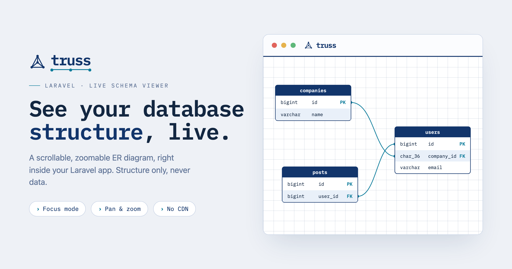

# Laravel Truss

<picture>
  <source media="(prefers-color-scheme: dark)" srcset="art/cover-dark.png">
  
</picture>

[](https://trussphp.com)
[](https://packagist.org/packages/albertoarena/laravel-truss)
[](https://packagist.org/packages/albertoarena/laravel-truss)
[](https://github.com/albertoarena/laravel-truss/actions/workflows/run-tests.yml)
[](LICENSE)


Laravel Truss is a live database structure viewer. It scans your live schema and renders it as a scrollable, zoomable ER diagram right inside your app, so you can see how the tables actually connect without opening a DB client. It reads **structure only** (tables, columns, keys, indexes); row data is never queried or exposed.

**[Try the live demo](https://trussphp.com/demo/)** to pan, zoom, focus, and export a sample schema in your browser, no install needed. See what has shipped and what is next on the **[roadmap](https://trussphp.com/roadmap/)**.

> **Stay updated:** click **Watch > Custom > Releases** to hear about new features, or follow along in [Discussions](https://github.com/albertoarena/laravel-truss/discussions).

## Features

- Live ER diagram of your database, rendered with Mermaid.
- Focus mode: a table and its foreign-key neighbours, centred and highlighted.
- Filter by table name, and toggle native types against Laravel-style labels.
- Map-style pan and zoom, with auto-fit and a Fit button.
- Export the diagram as PNG or SVG, or its structure as JSON, CSV, a Markdown data dictionary, or DBML, all generated in the browser and structure-only.
- Schema diff: see what changed since your last migration, in a dashboard "Changes" panel and via `php artisan truss:diff`. Structure-only, added / removed / changed tables, columns, indexes, and foreign keys.
- Schema doctor: review your structure for problems (missing primary keys, unindexed foreign keys, duplicate indexes, risky types) in the terminal or in CI with `php artisan truss:doctor`, and in a dashboard "Health" panel that flags the same problems on the diagram. Deterministic and structure-only, no AI.
- Multiple connections: list them in config and switch between their diagrams with a toolbar picker, each scoped to its own database.
- Light and dark "blueprint" theme.
- Self-contained: Mermaid and fonts are vendored and served from the package, so it works offline and under a strict Content-Security-Policy (no CDN).
- Cached snapshot, rebuilt automatically after migrations.

## Documentation

Full documentation is at **[trussphp.com](https://trussphp.com)**.

- [Installation](https://trussphp.com/getting-started/installation/)
- [Quick start](https://trussphp.com/getting-started/quick-start/)
- [Authorization](https://trussphp.com/guides/authorization/)
- [Configuration reference](https://trussphp.com/reference/configuration/)
- [Roadmap](https://trussphp.com/roadmap/)

## Installation

For local use, install Truss as a dev dependency:

```bash
composer require albertoarena/laravel-truss --dev
```

To run Truss gated on staging or production, install it as a **regular dependency** instead. Dev dependencies are excluded from `composer install --no-dev` builds, so a `--dev` install never reaches a production deploy and `/truss` returns 404 there:

```bash
composer require albertoarena/laravel-truss
```

Requires **PHP 8.3+** and **Laravel 12+**. The service provider is auto-discovered, so there is nothing to publish to get started.

## Quick start

By default Truss is enabled in the `local` environment only. Start your app and visit:

```
/truss
```

To use Truss in a non-local environment you must both enable it and authorize the viewers. See [Authorization](https://trussphp.com/guides/authorization/).

## Multiple connections

Out of the box Truss visualizes your application's default database connection. If your app spans more than one connection, for example a main database alongside a separate module database, list the connections you want to visualize under `truss.connections`:

```php
// config/truss.php
'connections' => [
    'mysql' => [],
    'modules' => ['excluded_tables' => ['module_jobs']],
],
```

When two or more connections are configured, a connection picker appears in the dashboard toolbar. Switching it re-renders that connection's schema, and the selection is kept in the URL so a given view can be shared or bookmarked. Each connection is introspected against its own database only, so a shared server never shows tables that belong to another database.

The keys are Laravel connection names from `config/database.php`. Per-connection options mirror the global ones (such as `excluded_tables`), so you can hide different tables on each connection.

## Schema doctor

`php artisan truss:doctor` (aliased `truss:check`) reviews your database structure for problems visible from structure alone: a table with no primary key, a foreign key with no index, duplicate indexes, money stored as a float, and more. It is deterministic and structure-only, with no AI and no network call, so it is safe to run in CI.

```bash
php artisan truss:doctor
php artisan truss:doctor --connection=mysql --format=json
php artisan truss:doctor --preset=strict --fail-on=warning
```

It exits `0` when clean, `1` when a finding is at or above the `--fail-on` level (default `error`), and `2` on a bad option or a snapshot error, so a migration that introduces a problem can fail the build. Presets (`recommended`, `strict`, `none`), per-rule severity and enable / disable, ignore patterns, and the fail level are all configurable under `truss.doctor`. See the [configuration reference](https://trussphp.com/reference/configuration/).

Structure only: it reads the same cached snapshot the diagram uses and never queries row data.

### In the dashboard

The same findings show in the dashboard. A "Health" panel (the heart toggle in the toolbar) lists them grouped by table, and every table with a problem carries a small severity badge on the diagram, so you can see what needs attention at a glance. Open the panel to read the findings, click a table to focus it, or click the marked column to see the finding for that field. Heuristic (lower-confidence) findings are marked as such.

It rides the schema endpoint the diagram already loads, so there is no extra request. Two switches control it under `truss.doctor`:

- `dashboard` (env `TRUSS_DOCTOR_DASHBOARD`, default on): show the Health panel at all. When off, the dashboard never receives any findings and the CLI is untouched.
- `flag_tables` (env `TRUSS_DOCTOR_FLAG_TABLES`, default on): always badge tables with findings on the diagram, even with the panel closed. Turn it off to keep the diagram clean and surface findings only when the panel is open.

## Storage

Truss keeps its schema snapshot in the cache, which is derived and disposable. The one thing it writes to disk is the **schema-diff baseline**: a structure-only JSON file (never row data) recorded after each migration so the diff can show what changed. It lives at `truss/baselines/{connection}.json` on the disk set by `truss.diff.disk` (the default disk otherwise), is safe to delete, and is worth gitignoring alongside `storage/`. To turn the feature off entirely so nothing is written to disk, set `TRUSS_DIFF_ENABLED=false` (or `truss.diff.enabled` to `false`).

## Security

Truss exposes structure only and never queries row data. Access is protected by the fixed `viewTruss` gate. If you discover a security issue, please email me@albertoarena.it rather than opening a public issue.

## Contributing

Contributions are welcome. Feel free to fork, improve, and open a pull request.

## Support

Laravel Truss is free and open source. If it has saved you time, you can support its ongoing maintenance and new features with a coffee:

**[ko-fi.com/albertoarena](https://ko-fi.com/albertoarena)**

Starring the repo and sharing it help just as much.

## License

The MIT License (MIT). See [LICENSE](LICENSE).
